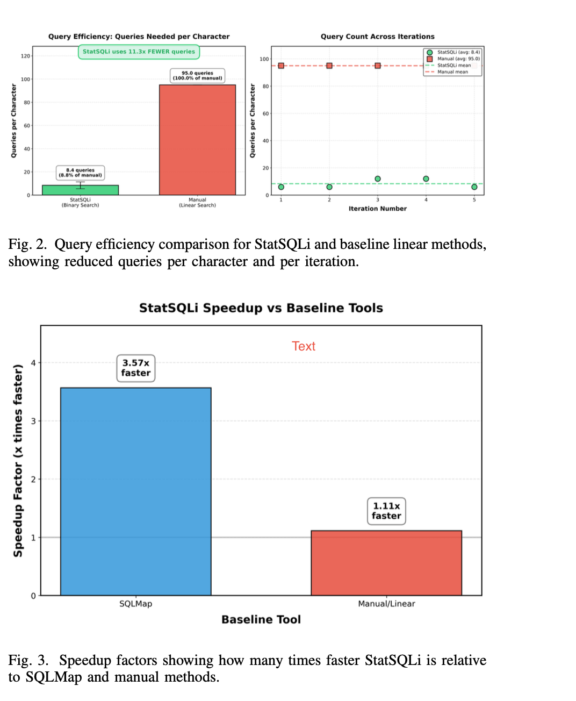
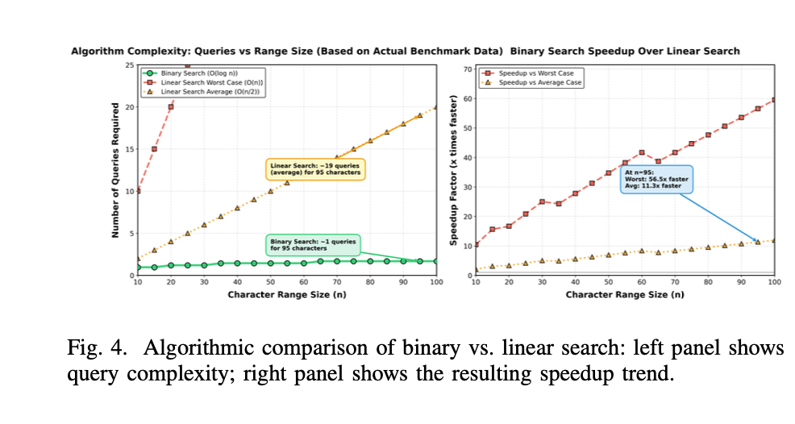

# Project Figures

This page includes the figures you added from the project report/screenshots.

## Fig. 1 - High-level architecture

**Caption:** High-level architecture of the StatSQLi framework.

## Fig. 2 and Fig. 3 - Query efficiency and speedup

**Caption (Fig. 2):** Query efficiency comparison for StatSQLi and baseline linear methods, showing reduced queries per character and per iteration.  
**Caption (Fig. 3):** Speedup factors showing how many times faster StatSQLi is relative to SQLMap and manual methods.

## Fig. 4 - Algorithmic complexity and speedup trend

**Caption:** Algorithmic comparison of binary vs linear search. Left panel shows query complexity, right panel shows speedup trend.
