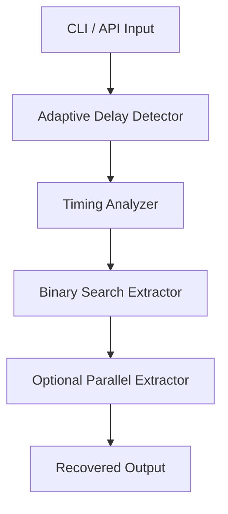
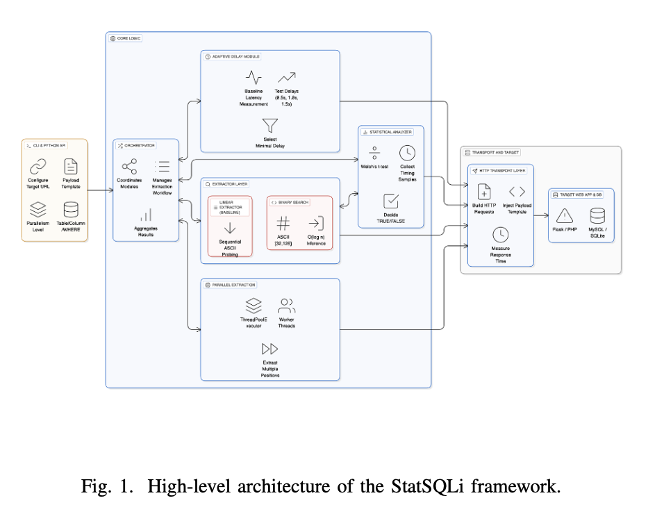

# Architecture

StatSQLi is organized as a modular pipeline so each concern (timing, extraction, adaptation, parallelism) can evolve independently.

## High-level flow

## Architecture figure

See also the dedicated [Figures](../figures.md) page for full report visuals.

## Module responsibilities

- `statsqli/main.py`
  - orchestration layer (`StatSQLi` class),
  - CLI parsing,
  - component composition and extraction entrypoints.
- `statsqli/adaptive.py`
  - baseline timing collection,
  - candidate delay testing,
  - minimal reliable delay selection.
- `statsqli/stats.py`
  - baseline statistics,
  - Welch t-test decision logic,
  - adaptive threshold helper methods.
- `statsqli/extractor.py`
  - binary-search character inference,
  - request timing collection and condition testing,
  - string reconstruction.
- `statsqli/parallel.py`
  - chunked position extraction with thread pools.
- `statsqli/traditional_extractor.py`
  - linear-search baseline implementation for comparisons.

## Design characteristics

- **Composable**: each module can be tested in isolation.
- **Experiment-friendly**: easy to compare strategies and tune parameters.
- **Benchmark-ready**: timing and query metrics can be captured across runs.
